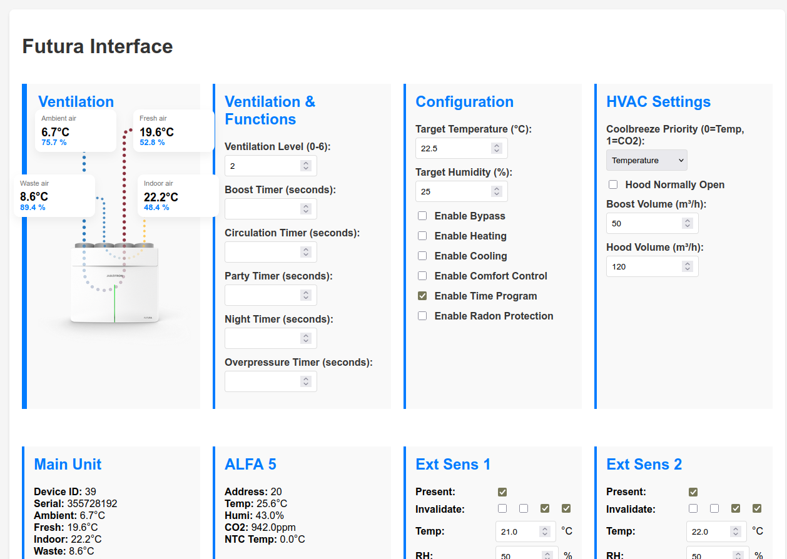

# Jablotron Futura Modbus UI & Metrics

A small Go service that reads Modbus registers from a Jablotron Futura unit, exposes Prometheus metrics, and serves a web UI to view/edit selected registers.



## Features
- Periodic Modbus polling with configurable interval
- Prometheus metrics at `/metrics`
- Web UI
- Read/write API endpoints for holding registers

## Quick Start
```bash
# 1) Download the latest release binary for your platform from GitHub Releases
#    Example (Linux x64):
#    curl -L -o gofutura https://github.com/danielkucera/gofutura/releases/latest/download/gofutura_linux_amd64
#    chmod +x gofutura

# 2) Run it
./gofutura --host 192.168.29.22
```
Then open `http://localhost:9090/` in your browser.

## Options
- `--host` (required): Modbus host or IP
- `--port` (default: 502): Modbus port
- `--slave-id` (default: 1): Modbus slave/unit id
- `--max-block-size` (default: 125): Max registers per Modbus read
- `--input-max-addr` (default: 255): Max input register address for validation
- `--holding-max-addr` (default: 1024): Max holding register address for validation
- `--http-port` (default: 9090): HTTP server port for metrics and UI
- `--poll-interval` (default: 5s): Polling interval for Modbus reads (Go duration format)

## Endpoints
- `GET /metrics`
- `GET /edit`
- `GET /api/read-holding`
- `GET /api/read-input`
- `POST /api/write-holding`
