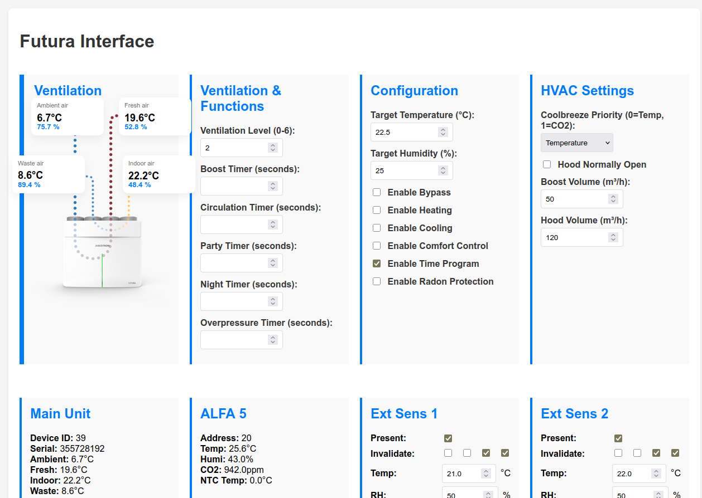

# Jablotron Futura Modbus UI & Metrics

A small Go service that reads Modbus registers from a Jablotron Futura unit, exposes Prometheus metrics, optionally publishes them to MQTT, and serves a web UI to view/edit selected registers.



## Features
- Periodic Modbus polling with configurable interval
- Prometheus metrics at `/metrics`
- Optional MQTT publishing of the current metric set
- Web UI
- Read/write API endpoints for holding registers

## Quick Start
```bash
# 1) Download the latest release binary for your platform from GitHub Releases
#    Example (Linux x64):
#    curl -L -o gofutura https://github.com/danielkucera/gofutura/releases/latest/download/gofutura_linux_amd64
#    chmod +x gofutura

# 2) Run it
./gofutura --host 192.168.29.22
```
Then open `http://localhost:9090/` in your browser.

## Options
- `--host` (required): Modbus host or IP
- `--port` (default: 502): Modbus port
- `--slave-id` (default: 1): Modbus slave/unit id
- `--max-block-size` (default: 125): Max registers per Modbus read
- `--input-max-addr` (default: 255): Max input register address for validation
- `--holding-max-addr` (default: 1024): Max holding register address for validation
- `--http-port` (default: 9090): HTTP server port for metrics and UI
- `--poll-interval` (default: 5s): Polling interval for Modbus reads (Go duration format)
- `--protocol` (default: tcp): Protocol scheme for the main Modbus bus, for example `tcp` or `rtuovertcp`
- `--damper-protocol` (default: tcp): Protocol scheme for the damper Modbus bus, for example `tcp` or `rtuovertcp`
- `--mqtt-url`: MQTT broker URL for publishing metrics, for example `tcp://mqtt.example.net:1883`
- `--mqtt-user`: MQTT username
- `--mqtt-pass`: MQTT password
- `--mqtt-topic-prefix` (default: `gofutura/metrics`): Topic prefix used for published metrics

When MQTT is configured, each poll publishes the currently exposed metrics to topics under the configured prefix. For example, `fut_temp_ambient_celsius` is published to `gofutura/metrics/fut_temp_ambient_celsius`, while labeled metrics such as `ui_temp_celsius{idx="1"}` are published to `gofutura/metrics/ui_temp_celsius/idx/1`.

The service also subscribes to write topics under the same prefix:

- `<prefix>/<FieldName>`
- `<prefix>/ext_sens_temp_celsius/idx/<N>`
- `<prefix>/ext_sens_rh_percent/idx/<N>`
- `<prefix>/ext_sens_co2_ppm/idx/<N>`
- `<prefix>/ext_sens_t_floor_celsius/idx/<N>`

Write topic resolution is lazy: on the first non-retained write message, the topic is resolved to the corresponding writable register field and cached for later writes.

When a numeric payload is received, the service attempts a single-register Modbus write using the existing writable field map (`WriteSingleRegister`). Example:

```bash
mosquitto_pub -h mqtt.example.net -t gofutura/metrics/CfgTempSet -m 21.5
mosquitto_pub -h mqtt.example.net -t gofutura/metrics/ext_sens_co2_ppm/idx/5 -m 900
```

If the field is unknown, requires multiple registers, or the payload is non-numeric, the message is ignored and an error is logged.

Use non-retained MQTT messages for write commands.

## Endpoints
- `GET /metrics`
- `GET /edit`
- `GET /api/read-holding`
- `GET /api/read-input`
- `POST /api/write-holding`
